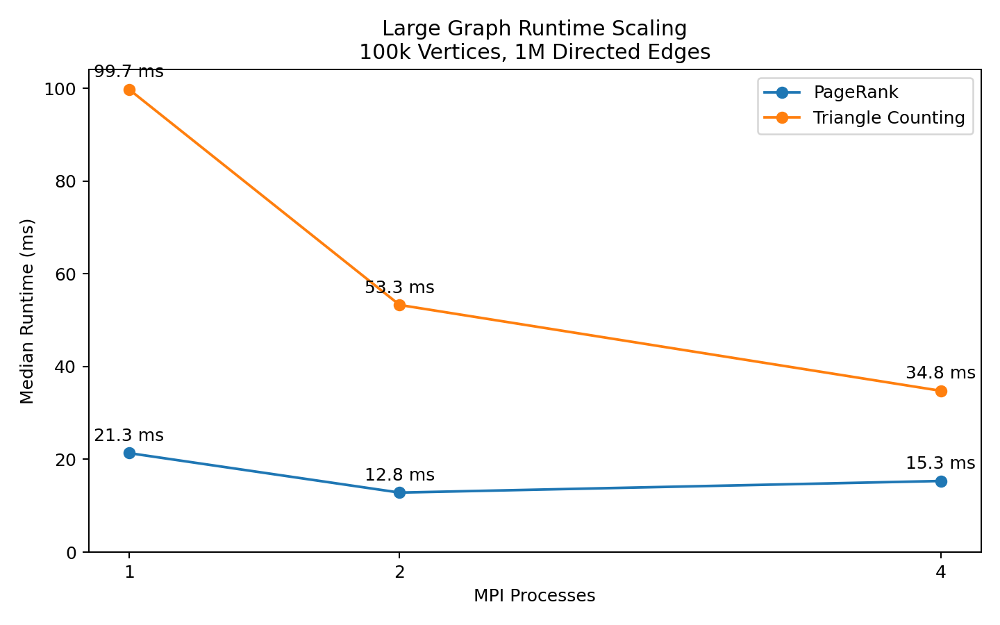

# Distributed Graph Analytics


A benchmark-driven C++17 and MPI graph analytics engine implementing
distributed PageRank and Triangle Counting. The project supports
selectable edge-aware and equal-vertex partitioning, multiple MPI
communication strategies, correctness validation across process counts,
and reproducible Docker-based benchmarks.

The evaluation measures both runtime scaling and per-rank workload
balance. Results show that Triangle Counting benefits more consistently
from additional MPI processes, while iterative PageRank is more
sensitive to communication overhead. On a deliberately degree-skewed
graph, edge-aware partitioning reduces the measured maximum-to-minimum
edge workload ratio from 20.60x to 1.00x.

## Benchmark Snapshot

The table below summarizes the median runtime from three benchmark runs. Speedup is calculated relative to the single-process runtime for the same graph and algorithm.

| Dataset | Algorithm | 1 Process | Best Parallel Run | Speedup | Main Observation |
|---|---|---:|---:|---:|---|
| Medium: 10k vertices, 120k edges | PageRank | 2.011 ms | 1.477 ms with 2 processes | 1.36x | Modest improvement; repeated communication limits scaling |
| Medium: 10k vertices, 120k edges | Triangle Counting | 11.591 ms | 2.979 ms with 4 processes | 3.89x | Clear scaling from heavier local computation |
| Large: 100k vertices, 1M edges | PageRank | 21.349 ms | 12.836 ms with 2 processes | 1.66x | Two processes help, while four-process runs are more variable |
| Large: 100k vertices, 1M edges | Triangle Counting | 99.736 ms | 34.784 ms with 4 processes | 2.87x | Consistent scaling across increasing process counts |

These results show that scalability depends on the algorithm's computation-to-communication ratio. Triangle Counting benefits more consistently from additional MPI processes, while iterative PageRank is more sensitive to communication and synchronization overhead.



The chart reports the median runtime from three runs on the
100k-vertex, 1M-edge graph. Triangle Counting scales consistently
from 1 to 4 processes, while PageRank performs best with 2 processes
and shows higher variability at 4 processes, consistent with increased
communication, synchronization, and runtime scheduling overhead.

### Partitioning Snapshot

A separate benchmark compares edge-aware and equal-vertex partitioning
on a deliberately degree-skewed synthetic graph with 10,000 vertices,
118,000 directed edges, and 4 MPI processes.

| Partition Strategy | Rank Workloads | Maximum / Average | Maximum / Minimum |
|---|---|---:|---:|
| Edge-aware | 29,500 / 29,500 / 29,500 / 29,500 | 1.00x | 1.00x |
| Equal-vertex | 103,000 / 5,000 / 5,000 / 5,000 | 3.49x | 20.60x |


On this constructed dataset, equal vertex counts do not produce equal
computational work because the high-degree vertices are concentrated at
the beginning of the vertex range. Edge-aware partitioning instead
assigns each rank the same number of outgoing edges.

This benchmark demonstrates improved workload balance rather than a
20.60x runtime speedup. End-to-end runtime also depends on MPI
communication, synchronization, memory access, and algorithm-specific
processing costs.

Detailed measurements and interpretation are available in [docs/performance.md](docs/performance.md).

## Features

- Distributed PageRank and Triangle Counting implemented in C++17 with MPI
- Selectable edge-aware and equal-vertex graph partitioning
- Shared partitioning utilities used by both distributed algorithms
- Multiple MPI communication strategies for combining partial results
- Numeric correctness tests across 1 and 4 MPI processes
- Correctness validation for both partitioning strategies
- Runtime benchmarks across 1, 2, and 4 MPI processes
- Degree-skewed workload benchmark with per-rank edge measurements
- Reproducible graph generators, CSV results, and visualization scripts
- Docker-based OpenMPI build, test, and benchmark environment
- GitHub Actions continuous integration

## Repository Structure

```text
.
├── benchmarks/                    # Committed benchmark result datasets
├── core/
│   ├── graph.h                    # Binary graph representation and loader
│   └── partition.h                # Shared partitioning strategies
├── data/                          # Small and medium graph inputs
├── docs/
│   ├── images/                    # Generated benchmark charts
│   └── performance.md             # Detailed performance analysis
├── scripts/
│   ├── generate_large_graph.py
│   ├── generate_skewed_graph.py
│   ├── plot_partition_balance.py
│   └── plot_runtime_scaling.py
├── src/
│   ├── page_rank_parallel.cpp
│   └── triangle_counting_parallel.cpp
├── tests/
│   ├── run_benchmark.sh
│   ├── run_correctness.sh
│   └── run_partition_benchmark.sh
├── Dockerfile
├── Makefile
└── README.md
```

## Algorithms

### PageRank

PageRank is computed iteratively. Each MPI rank owns a contiguous range
of vertices selected by one of two partitioning strategies:

- `edge`: assigns ranges based on outgoing-edge counts
- `vertex`: assigns approximately equal numbers of vertices

Edge-aware partitioning is the default.

During each iteration:

1. Each rank processes the outgoing edges for its assigned vertices.
2. Local PageRank contributions are accumulated.
3. MPI communication combines partial contributions across processes.
4. Each rank updates the PageRank values for its local vertex block.

The implementation reports each rank's processed edge count and
communication time. Rank 0 reports the final PageRank sum and total
runtime.

### Triangle Counting

Triangle Counting uses the same selectable partitioning strategies.
Each rank counts triangles involving vertices in its assigned range,
then local counts are combined through MPI communication.

Rank 0 reports the final unique triangle count and total runtime.

## Graph Input Format

The programs currently read graph input through the shared `Graph::readGraphFromBinary<int>()` loader. The value passed to `--inputFile` is a graph input prefix. For example,
`data/small_graph` refers to `data/small_graph.csr` and
`data/small_graph.csc`.

Example input paths used in this project:

```text
data/small_graph
data/medium_graph
```

## Build and Run

Requirements:

- C++17 compiler
- OpenMPI
- `make`

Build both MPI executables:

```bash
make
```

This produces:

```text
page_rank_parallel
triangle_counting_parallel
```

Run correctness tests:

```bash
make test
```

Run the default medium-graph benchmark:

```bash
make benchmark
```

Generate the large benchmark graph locally:

```bash
make generate-large
```

Run the large-graph benchmark:

```bash
make benchmark-large
```

Generate the degree-skewed partition benchmark graph:

```bash
make generate-skewed
```

Compare per-rank workload under edge-aware and equal-vertex
partitioning:

```bash
make benchmark-partition
```

The partition benchmark writes its detailed results to:

```text
benchmarks/partition_loads.csv
```

Regenerate the partition workload chart:

```bash
make plot-partition
```

Clean build outputs:

```bash
make clean
```

## Manual Execution

You can also run each algorithm manually with `mpirun`.

### PageRank

```bash
mpirun -np 4 \
  ./page_rank_parallel \
  --inputFile data/small_graph \
  --nIterations 20 \
  --strategy 2 \
  --partition edge
```

### Triangle Counting

```bash
mpirun -np 4 \
  ./triangle_counting_parallel \
  --inputFile data/small_graph \
  --strategy 2 \
  --partition edge
```

Useful arguments:

| Argument | Used By | Meaning |
|---|---|---|
| `--inputFile` | PageRank, Triangle Counting | Binary graph input prefix |
| `--strategy` | PageRank, Triangle Counting | MPI communication strategy |
| `--partition edge` | PageRank, Triangle Counting | Edge-aware partitioning; default |
| `--partition vertex` | PageRank, Triangle Counting | Equal-vertex partitioning |
| `--nIterations` | PageRank | Number of PageRank iterations |

## Run with Docker

Build the Docker image:

```bash
docker build -t distributed-graph-analytics .
```

Open a shell inside the container:

```bash
docker run --rm -it distributed-graph-analytics
```

Inside Docker, build, test, and run the default benchmark:

```bash
make
make test
make benchmark
```

For commands that generate files or benchmark data, mount the local
repository so the results remain available after the container exits:

```bash
docker run --rm \
  -v "$PWD":/app \
  -w /app \
  distributed-graph-analytics \
  bash -lc "make benchmark-partition"
```

Run the large-graph benchmark through Docker:

```bash
docker run --rm \
  -v "$PWD":/app \
  -w /app \
  distributed-graph-analytics \
  bash -lc "make benchmark-large"
```

## Correctness Testing

The correctness suite runs both algorithms with:

- 1 MPI process
- 4 MPI processes
- Edge-aware partitioning
- Equal-vertex partitioning

The small test graph has known expected results:

```text
PageRank sum: 6.000000
Unique triangles: 2
```

The test script parses only the final numeric result fields rather than
comparing complete program output. This avoids false failures caused by
rank print order, runtime measurements, and communication-time noise.

PageRank values are checked with a floating-point tolerance of `0.0001`.
Triangle counts are checked using exact integer equality.

For each partitioning strategy, the suite verifies:

1. The 1-process result matches the expected result.
2. The 4-process result matches the expected result.
3. The 1-process and 4-process results match each other.

Run the complete suite with:

```bash
make test
```

## Benchmark Methodology

The project benchmarks the same graph input across different MPI
process counts. The goal is not only to find speedup, but also to
identify where communication overhead outweighs the benefit of
parallel execution.

Measured values include:

- Total runtime
- Number of processed edges per rank
- Communication time per rank
- Final algorithm result

Detailed benchmark tables, methodology, limitations, and interpretation
are available in [docs/performance.md](docs/performance.md).

## Future Work

- Compare edge-aware and equal-vertex partitioning using end-to-end
  runtime, not only edge workload
- Benchmark a real scale-free or power-law graph
- Record benchmark hardware and environment metadata
- Separate computation time from MPI communication time
- Test across multiple machines or an MPI cluster
- Evaluate graphs with millions of vertices and edges
