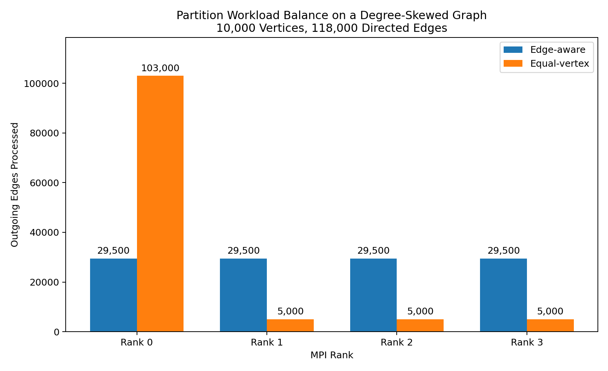

# Performance Analysis

This document explains the benchmark results for the distributed PageRank and Triangle Counting implementations.

## Goal

The goal of this benchmark is to measure when MPI-based parallelism improves runtime and when communication overhead dominates.

This project does not assume that more processes always make the program faster. Instead, it compares different process counts and analyzes the tradeoff between computation and communication.

## Benchmark Variables

The main variables are:

- Graph size
- Number of vertices
- Number of edges
- Number of MPI processes
- Number of PageRank iterations
- Communication strategy
- Per-rank edge workload
- Per-rank communication time

## Small Graph Result

The small graph has only 6 vertices and 9 edges.

On this graph, 4 MPI processes are slower than 1 process.

This is expected because each process receives very little computation. The overhead of starting MPI processes, synchronizing ranks, and communicating partial results is larger than the computation saved by parallel execution.

## Medium Graph Benchmark Results

Dataset:

- 10,000 vertices
- 120,000 directed edges
- 20 PageRank iterations
- Each process count was run 3 times because millisecond-level MPI benchmarks can vary between runs.

### PageRank

| Processes | Run 1 | Run 2 | Run 3 | Result |
|---:|---:|---:|---:|---:|
| 1 | 0.002011s | 0.001969s | 0.002046s | Sum = 9999.979492 |
| 2 | 0.001795s | 0.001477s | 0.001409s | Sum = 10000.008789 |
| 4 | 0.001452s | 0.001577s | 0.001597s | Sum = 9999.993164 |

PageRank shows small runtime differences on this medium graph. Because all measurements are around 1–2 milliseconds, the result is sensitive to measurement noise and runtime scheduling. The PageRank sums remain close to the number of vertices, with small differences caused by floating-point accumulation order across MPI processes.

### Triangle Counting

| Processes | Run 1 | Run 2 | Run 3 | Result |
|---:|---:|---:|---:|---:|
| 1 | 0.011759s | 0.011591s | 0.011589s | Unique triangles = 581 |
| 2 | 0.005820s | 0.005938s | 0.005784s | Unique triangles = 581 |
| 4 | 0.003190s | 0.002958s | 0.002979s | Unique triangles = 581 |

Triangle Counting scales more clearly on this graph. The 4-process run is consistently faster than the 1-process run because the algorithm performs more local edge-neighborhood computation before combining counts.

## Large Graph Benchmark Results

Dataset:

- 100,000 vertices
- 1,000,000 directed edges
- 20 PageRank iterations
- Each process count was run 3 times.

The large graph was generated locally with `scripts/generate_large_graph.py`. The generated `.csr` and `.csc` files are ignored by Git because they are benchmark artifacts.

### PageRank

| Processes | Run 1 | Run 2 | Run 3 | Result |
|---:|---:|---:|---:|---:|
| 1 | 0.021349s | 0.020804s | 0.021947s | Sum = 99979.203125 |
| 2 | 0.012903s | 0.012836s | 0.012634s | Sum = 99978.562500 |
| 4 | 0.021357s | 0.015340s | 0.010275s | Sum = 99978.710938 |

On the larger graph, PageRank begins to benefit from MPI parallelism. The 2-process run is consistently faster than the 1-process run. The 4-process runs show more variability, which suggests that communication overhead and runtime scheduling still affect performance.

The PageRank sums remain close to the number of vertices. The small differences are expected because floating-point accumulation order can differ across MPI process counts.

### Triangle Counting

| Processes | Run 1 | Run 2 | Run 3 | Result |
|---:|---:|---:|---:|---:|
| 1 | 0.099736s | 0.097300s | 0.117366s | Unique triangles = 306 |
| 2 | 0.053282s | 0.051529s | 0.066723s | Unique triangles = 306 |
| 4 | 0.035133s | 0.029912s | 0.034784s | Unique triangles = 306 |

Triangle Counting scales more clearly on the large graph. The 4-process run is consistently faster than the 1-process and 2-process runs because the algorithm performs heavier local edge-neighborhood computation before the final count reduction.

## Interpretation

The benchmark shows that MPI scalability depends on the algorithm and the computation-to-communication ratio.

PageRank requires repeated communication across iterations, and the measured runtimes are very small on the current medium graph. This makes the benchmark sensitive to timing noise. Triangle Counting performs heavier local computation and only needs to combine counts at the end, so it benefits more clearly from parallel execution on this graph.

The large graph benchmark provides stronger evidence than the medium graph because the computation per process is larger, making it easier to observe when MPI parallelism offsets communication overhead.

This is an important result: the project does not simply claim that MPI is always faster. It measures when distributed execution helps, when communication overhead matters, and when the benchmark is too small to make strong scaling claims.


## Why More Processes Can Be Slower

Adding more MPI processes introduces costs:

- More ranks need to synchronize.
- Partial PageRank values need to be communicated.
- Each rank performs less computation.
- Communication becomes a larger percentage of total runtime.
- Small and medium graphs may not provide enough work to amortize MPI overhead.

This means that parallel performance depends on the ratio between computation and communication.

## Partitioning Strategy Comparison

The project supports two contiguous vertex-partitioning strategies:

- **Equal-vertex partitioning** assigns approximately the same number
  of vertices to every MPI rank.
- **Edge-aware partitioning** assigns contiguous vertex ranges based
  on outgoing-edge counts, with the goal of distributing edge-processing
  work more evenly.

Equal-vertex partitioning is simple and guarantees similar vertex
counts, but it can become imbalanced when a small group of vertices has
a much higher degree than the rest of the graph.

### Degree-Skewed Benchmark Dataset

To isolate the effect of partitioning, the project includes a
deterministic synthetic graph generated by
`scripts/generate_skewed_graph.py`.

Dataset:

- 10,000 vertices
- 118,000 directed edges
- Vertices 0–999 have an out-degree of 100
- Vertices 1,000–9,999 have an out-degree of 2
- 4 MPI processes
- No self-loops or duplicate edges

The high-degree vertices are intentionally grouped at the beginning of
the vertex ID range. This creates a worst-case example for contiguous
equal-vertex partitioning: rank 0 receives most of the high-degree
vertices even though every rank receives the same number of vertices.

This graph is synthetic and intentionally skewed. It is used to
demonstrate and measure workload balance, not to claim that every
real-world graph will produce the same distribution.

### Workload Measurement

The benchmark records the number of outgoing edges processed by each
MPI rank.

For PageRank, the benchmark uses one iteration so that
`edges_processed` directly represents the number of edges assigned to
the rank rather than the edge count multiplied by the number of
iterations.

PageRank and Triangle Counting report the same per-rank edge workloads
because both algorithms use the same partition ranges.

| Partition Strategy | Rank 0 | Rank 1 | Rank 2 | Rank 3 | Minimum | Maximum | Maximum / Average | Maximum / Minimum |
|---|---:|---:|---:|---:|---:|---:|---:|---:|
| Edge-aware | 29,500 | 29,500 | 29,500 | 29,500 | 29,500 | 29,500 | 1.00x | 1.00x |
| Equal-vertex | 103,000 | 5,000 | 5,000 | 5,000 | 5,000 | 103,000 | 3.49x | 20.60x |



On this dataset, edge-aware partitioning assigns exactly 29,500 edges
to each rank. Equal-vertex partitioning assigns 103,000 of the 118,000
edges to rank 0, while the other ranks process only 5,000 edges each.

As a result:

- The busiest equal-vertex rank processes 3.49 times the average load.
- The busiest equal-vertex rank processes 20.6 times as many edges as
  the least busy rank.
- Edge-aware partitioning reduces the measured workload imbalance to
  1.00 times the average on this constructed graph.

These results demonstrate that equal vertex counts do not necessarily
produce equal computational work when vertex degrees are skewed.

### What This Benchmark Does Not Prove

Improved workload balance does not automatically guarantee an equal
runtime improvement.

Total runtime can also depend on:

- MPI communication and synchronization
- Memory-access patterns
- PageRank iteration count
- Triangle intersection cost
- Operating-system scheduling
- Graph structure beyond outgoing-edge counts

The benchmark therefore supports the narrower conclusion that
edge-aware partitioning distributes outgoing-edge work more evenly on
the degree-skewed graph. A separate runtime experiment would be needed
to measure the resulting end-to-end speedup.

### Reproducing the Partition Benchmark

Generate the synthetic graph:

```bash
make generate-skewed
```

### Running Benchmarks

Run locally when OpenMPI is installed:

```bash
make benchmark-partition
```

Or run the benchmark in the reproducible Docker environment:

```
docker run --rm \
  -v "$PWD":/app \
  -w /app \
  distributed-graph-analytics \
  bash -lc "make benchmark-partition"
```

The detailed per-rank results are written to:

```text
benchmarks/partition_loads.csv
```

Regenerate the workload chart:

```bash
make plot-partition
```

## Overall Interpretation

The current benchmarks show that MPI scalability depends on graph size,
algorithm structure, communication frequency, and workload balance.

- **Small graph:** One process is faster because the graph contains too
  little work to amortize MPI startup and communication overhead.
- **Medium PageRank:** Two processes achieve the best median runtime,
  but the measurements are short enough to remain sensitive to timing
  noise.
- **Medium Triangle Counting:** Four processes provide clear and
  consistent runtime improvement.
- **Large PageRank:** Two processes consistently outperform one process,
  while four-process measurements are more variable.
- **Large Triangle Counting:** Four processes consistently provide the
  fastest runtime.
- **Degree-skewed graph:** Edge-aware partitioning distributes outgoing
  edges much more evenly than equal-vertex partitioning.

The results do not support the claim that adding MPI processes always
improves performance. They instead show when distributed execution
helps, when communication overhead matters, and why partitioning must
account for graph workload rather than vertex count alone.

## Limitations

The current evaluation has several limitations:

- Benchmarks were run on a single machine rather than a multi-node
  cluster.
- Some measured runtimes are only a few milliseconds and are sensitive
  to operating-system scheduling and measurement noise.
- Process counts are limited to 1, 2, and 4.
- The partitioning comparison uses a deliberately skewed synthetic
  graph.
- Edge count is an approximation of computational work; vertices with
  the same degree may still have different processing costs.
- Improved workload balance has not yet been measured against
  end-to-end runtime for both partitioning strategies.

## Future Work

Potential extensions include:

- Benchmarking a real scale-free or power-law graph
- Comparing edge-aware and equal-vertex partitioning using end-to-end
  runtime
- Recording load-imbalance metrics automatically for multiple process
  counts
- Separating computation time from communication time
- Testing on multiple machines or an MPI cluster
- Evaluating larger graphs, such as 1 million vertices and 5 million or
  more edges